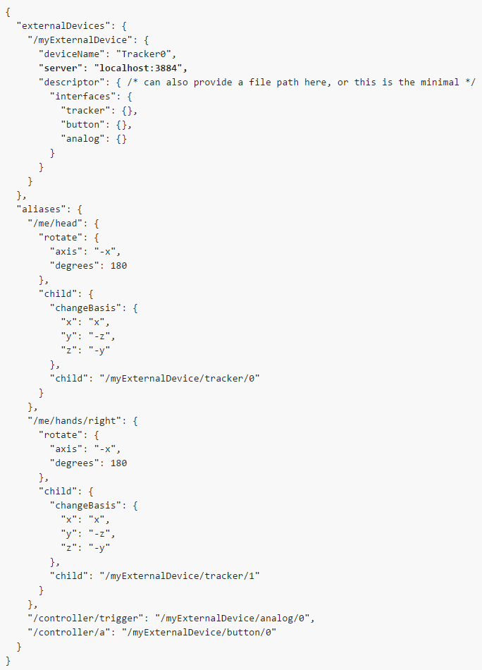

# Local and Distributed Client/Server Configuration

OSVR employs a client/server architecture. Multiple clients and servers can co-exist. The server(s) interface with the sensors and run the analysis plugins. The client(s) provide services to the application. 

The __most common__ configuration is the client and server residing on the same machine. For instance, an _OSVR server_ and then a game both running on the same Windows machine.

Even in this configuration, you can run **multiple clients with one server**. For instance, the _OSVR Tracker Viewer_ tool helps ensure that all the trackers are working. It is actually an OSVR application that connects to an OSVR server. Developers often run the *Tracker Viewer* alongside the application under development. 

Connecting a **single client to multiple servers** allows accessing shared resources. For instance, imagine a wide-area tracking system that tracks multiple users and then a computer that generates the scene for each player. An *OSVR server* could be installed on the machine that manages the wide-area tracking system. Each *OSVR client* on the player's PC can access local data (such as buttons from a locally-connected game controller) via the local *OSVR server* and then remote data from the remote *OSVR server*

In the OSVR-Core binary shapshot, there are a couple of sample configurations for this. They're in /bin/sample-configs. One is named osvr_server_config.externalvrpn.sample.json and the other is osvr_server_config.externalvrpn.G4.sample.json. Here is the former which shows how to configure the server:

One can have as many items as one wants, all pointing at various servers.

Clients and servers do not necessarily need to run on the same operating system. The client/server architecture of OSVR allows you to mix and match operating systems as required
