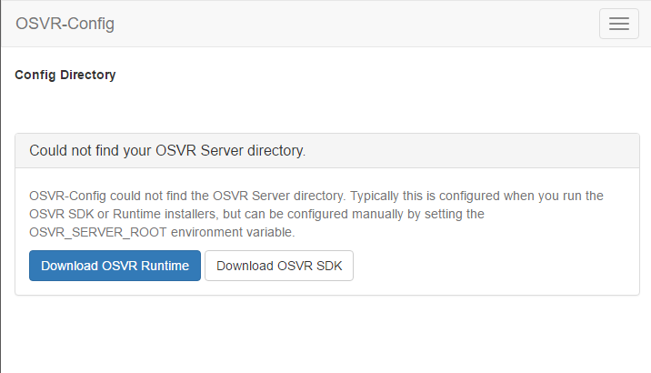
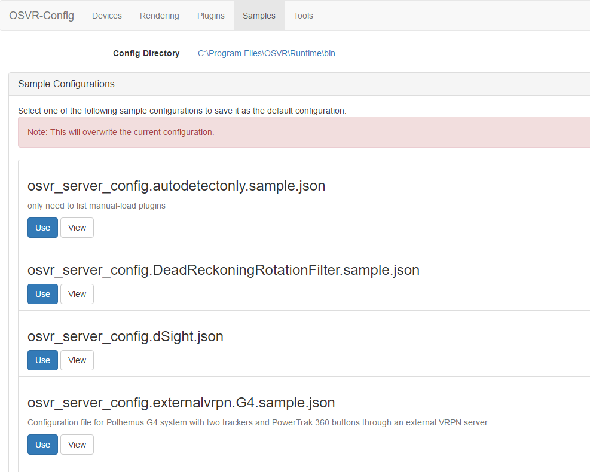
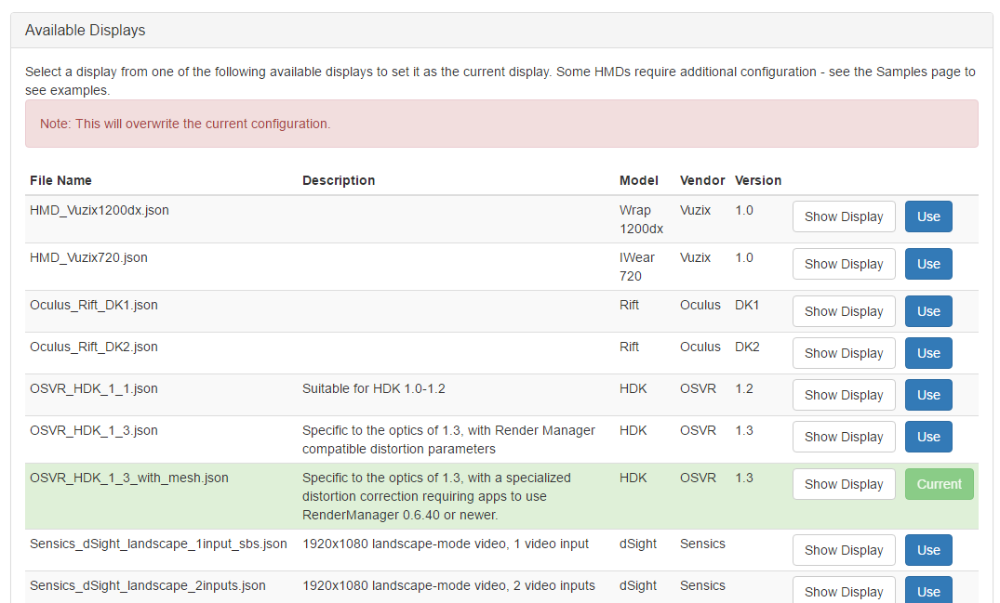
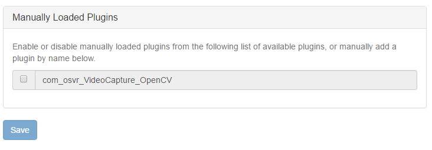
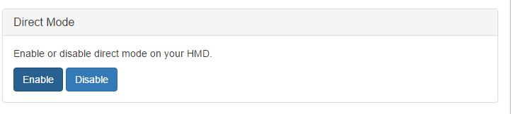
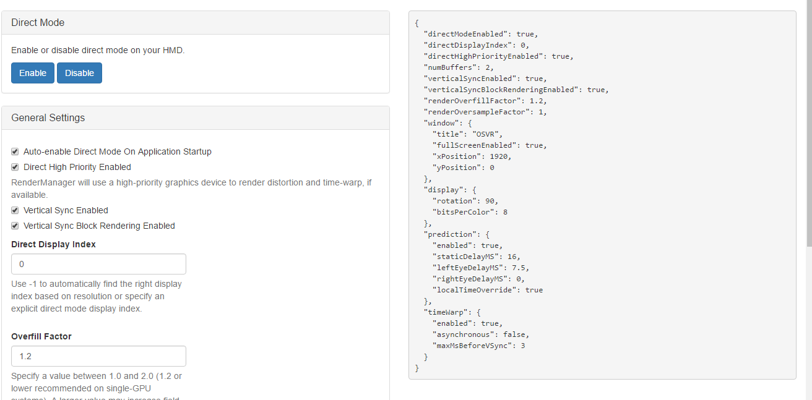
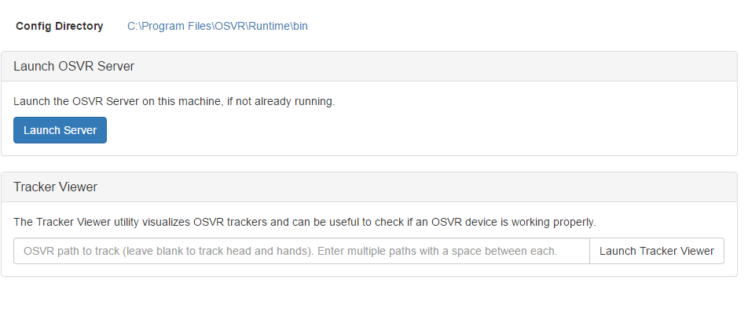

# Using the OSVR-Config Utility
OSVR-Config is a utility installed along with the OSVR SDK or the OSVR Runtime installers, and requires one of those to be installed to work. Once installed, simply launch OSVR-Config.exe from the SDK directory to start the utility in your browser. OSVR-Config is Windows-only at the moment, but Mac and Linux versions are planned.

### Tutorial Video
A YouTube video demonstrating OSVR-Config exists [here](https://www.youtube.com/watch?v=yuTSr8JMPUI).

### OSVR_SERVER_ROOT Environment Variable
In order for OSVR-Config to work, you need to define the `OSVR_SERVER_ROOT` environment variable to point to the `bin` folder of your current OSVR Runtime or OSVR SDK install directory. If you see this page, it means the environment variable is not set, and you'll need to set it before continuing:

This environment variable is set by the the OSVR Runtime or SDK installers, but you can also set it yourself.

### Samples Tab
The OSVR runtime comes with a set of sample configurations to get you started. Using a pre-made sample configuration is the easiest way to get started. To use a sample configuration, click the Samples tab:

Once here, review the list of sample configurations (some of which have descriptions). You can view a sample by clicking View, or click Use to set that sample configuration as the current server configuration.

### Devices Tab
The devices tab allows you to select a display configuration from a list of included displays. Review the list of displays available along with their descriptions, vendors, and version numbers. View a display config by clicking Show Display, or select one by clicking Use. The currently selected display will be highlighted in green:

### Plugins Tab
The plugins tab allows you to enable or disable optional plugins from a list of available plugins. These are plugins that are not auto-loaded by the OSVR server on startup, but instead must be explicitly enabled. Simply check or uncheck plugins from the list, and then click Save to save your changes.

### Render Tab
The rendering tab allows you to enable or disable direct mode, and view or modify the current OSVR render manager settings.

Use the Direct Mode Enable or Disable buttons to enable or disable direct mode:

The rest of the page allows you to view render manager settings. Note that some advanced settings are hidden by default. At the bottom, there is a checkbox to view these advanced settings:

You can preview the render manager config json on the right as you change settings:

When you're done changing settings, click Save at the bottom of the page:

### Tools Tab
The tools tab contains a couple of OSVR utilities. You can launch the OSVR server from here, or launch the Tracker Viewer utility to help test your configuration:

