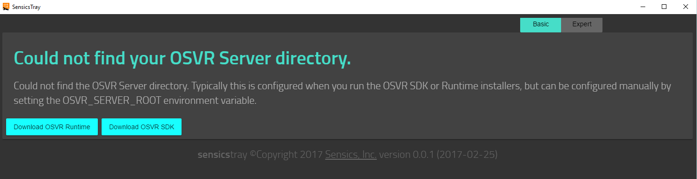
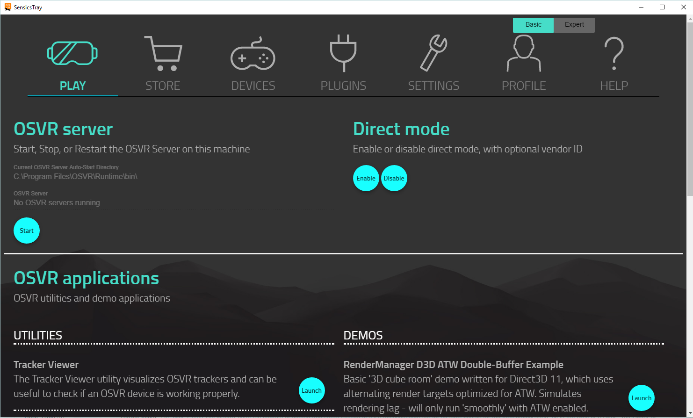
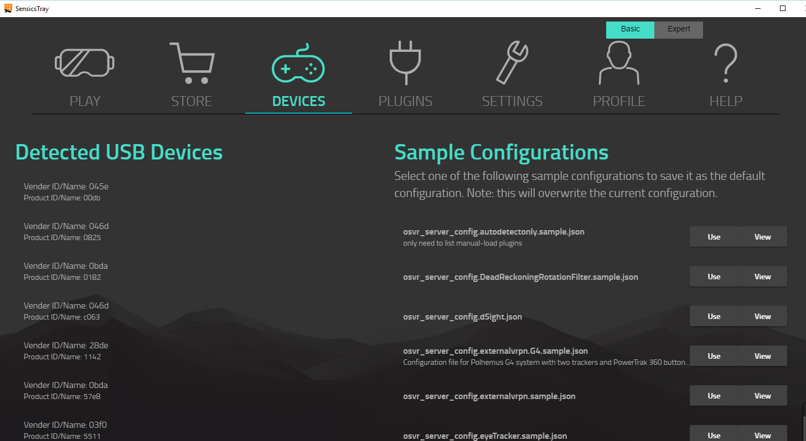
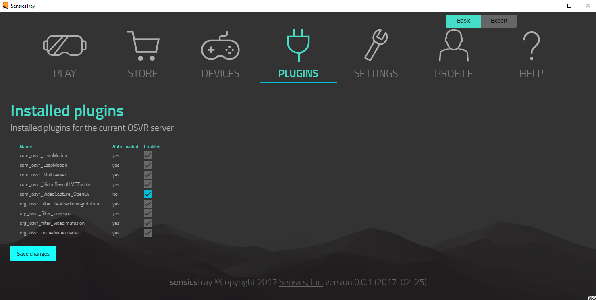
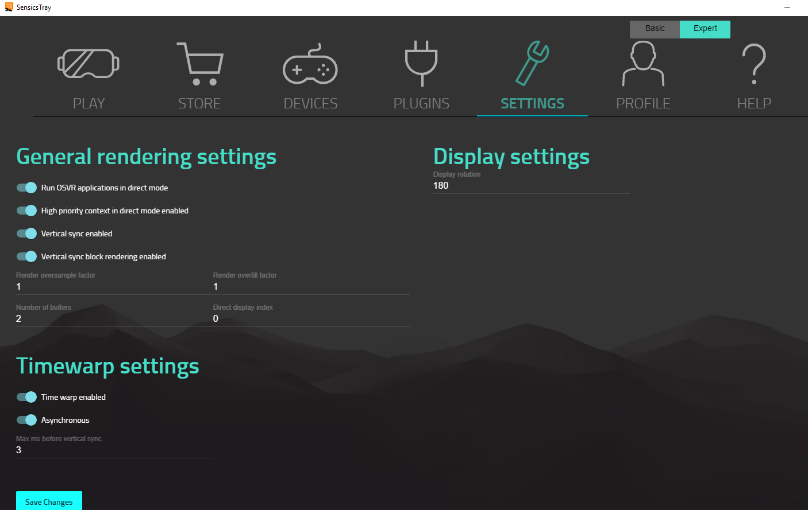

# Using the SensicsTray Utility
SensicsTray is a utility installed separately from the OSVR SDK or the OSVR Runtime installers, and requires one of those to be installed to work. Once installed, simply launch SensicsTray.exe from the Start menu to start the utility. SensicsTray is Windows-only at the moment.

 * [Download here](https://github.com/sensics/SensicsTray/releases)
 
### OSVR_SERVER_ROOT Environment Variable
In order for SensicsTray to work, you need to define the `OSVR_SERVER_ROOT` environment variable to point to the `bin` folder of your current OSVR Runtime or OSVR SDK install directory. If you see this page, it means the environment variable is not set, and you'll need to set it before continuing:

This environment variable is set by the the OSVR Runtime or SDK installers, but you can also set it yourself.

### Advanced vs Basic Mode
At the top of the screen is a toggle that switches between advanced and basic modes. Various tabs may show more or less settings or options based on which mode you are in.

### Play Tab
The Play tab has utilities to start, stop, or restart the OSVR server; enable or disable direct mode on your HMD; run the Tracker Viewer utility to test your setup; or run the Reset-Yaw utility to calibrate your HMD's forward direction. In addition, it contains a list of test or sample applications that run in OSVR supported HMDs to help you test your configuration.

### Devices Tab
The OSVR runtime comes with a set of sample configurations to get you started. Using a pre-made sample configuration is the easiest way to get started. To use a sample configuration, click the Devices tab:

Once here, review the list of sample configurations on the right (some of which have descriptions). You can view a sample by clicking View, or click Use to set that sample configuration as the current server configuration.

The devices tab also shows you a list of USB devices connected to your system. Some OSVR supported devices will also show up with a name and description.

### Plugins Tab
The plugins tab allows you to enable or disable optional plugins from a list of available plugins. These are plugins that are not auto-loaded by the OSVR server on startup, but instead must be explicitly enabled. Simply check or uncheck plugins from the list, and then click Save to save your changes. If the checkbox next to a plugin is disabled, that means the plugin is configured to automatically load, and will always be enabled.

### Settings Tab
The settings tab allows you to view or modify the current OSVR render manager settings. Note that some advanced settings are hidden by default. Enable advanced mode by clicking Advanced at the top of the screen to see all settings, or use Basic mode to view only basic settings. When you're done changing settings, click Save at the bottom of the page.

