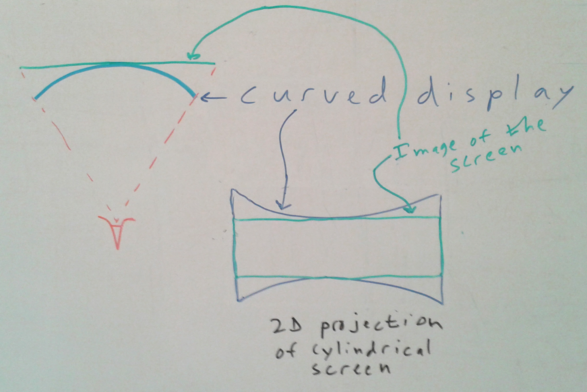
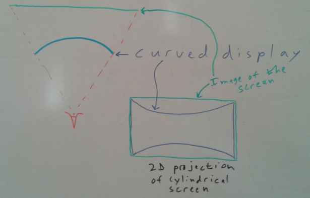

# OSVR Distortion Correction

**Warning:** This is an in-process working draft document as of 11/16/2015.  It was designed using Brooks' Maxim: "It is better to be specific and wrong than to be vague."  If you see a statement here that you do not believe to be true, or an approach that seems suboptimal, please email russ@sensics.com so it can be fixed.

This document describes the OSVR distortion correction, which happens after the display is rendered onto a planar rectangle. See the [projection and view matrices document](./projectionAndViewMatrices.md) for how to handle this phase of rendering.

## Overview

The basic function of distortion correction is to gather to physical display pixels viewed through a lens that causes distortion (or displayed on a non-planar screen) from the appropriate location on a canonical rectangular, planar screen.  An overfilled version of this rectangular, planar screen is produced by the projection and view matrices.  To avoid undefined visible regions, the canonical screen together with the overfill factor must be sufficient to cover all points that the undistortion map pulls into view.

Conceptually (1) The projection and view transforms take points in 3D model space and project them onto a canonical rectangular and planar screen, and (2) distortion correction adjusts the resulting image to undo the nonlinear effects of lenses or curved screens used to view it, pulling each point from its canonical location back into its physical location.  (The canonical rectangular, planar projection screen to be used is also determined as part of the distortion-correction process.)

## Approach

There are many potential classes of distortion, including those introduced by lenses and those introduced by display on a non-planar surface.  Within its rendering pipeline, OSVR handles the general case using a distortion mesh; its configuration files also include the ability to specify per-color radial distortion parameters.  Two specific cases are discussed below and then the general solution is described.

### Curved screen

The image below shows an example of a curved display (like the currently-available OLED TVs) viewed without a lens from a viewpoint in the middle of the screen along the screen's normal at that location.  The left part of the image shows a top-down 1D view of the scene and the right side shows a first-person view of the screen from the eye's point of view.  As with radially-distorting lenses, **distortion correction for a curved screen depends on the viewer's eye position**.  The more curved the screen, then more pronounced the effect.

In this figure, the blue screen is the (distorted) screen that would be seen and the green rectangle is one possible choice for an undistorted screen image.  We are free to choose any depth for the image of the screen so long as we adjust its projected size to match the extents seen in the 2D view -- it could be brought closer and scaled down or pushed back further and scaled up.  This particular image of the screen is smaller than the physical screen -- there are locations on the physical screen that are outside the virtual screen.

The image below shows the OSVR approach to undistorting the cylindrical projection.

**What is not done:** The right side of the image shows an approach that might be taken, but is not.  This is to pre-distort the original scene geometry by the inverse of the optical distortion that will be done by the cylindrical projection so that the resulting rendered image can be directly drawn on the (blue) screen and have the correct (green) projected image.  This requires applying an arbitrary nonlinear mapping to the geometry, which is not easily done and which would do piecewise-linear interpolation across triangles.  Another way to do this same pre-distortion would be to do a standard render pass and then do a second pass where the original rectangular texture generated in the first pass is rendered onto distorted geometry that projects onto the appropriate location on the screen (similar to the second rendering pass described in the approach below).  Either method produces an image that includes a non-linear warping of the geometry, resulting in an image that cannot be translated or rotated to handle the effects of head rotation ("time warp"), leading us to choose a different approach for the OSVR system.

**What is done:** The left side of the image shows the approach taken by OSVR, which is to determine what point on the virtual screen's image (green) corresponds to each point on the distorted real screen (blue).  During the final render pass, the texture coordinates for each point are adjusted to read each visible pixel from its corresponding location.  This undistortion can be done in the **vertex shader** by producing a dense mesh that has adjusted texture coordinates for each color or in the **pixel shader** either by applying a function to the texture coordinates or using a **texture map** to provide the new texture coordinate for each color to map to the proper location on the screen.

The initial implementation within the OSVR RenderManager uses the distortion-mesh approach.

### Per-color radial distortion

The image below shows an example of a viewing a rectangular screen (black) through a lens system that has radial distortion.  This particular lens has a different magnification for each wavelength of light, resulting in three different distorted images, one per primary color.

This distortion happens in addition to the desired behavior of the lens, which is to magnify the physical display and to move its virtual image further from the eye so that the viewer can focus on it.  It is possible to make lens systems that are achromatic and produce the same per-color distortion, but it is also possible to correct for this chromatic distortion within the rendering system.

Here, the distortion depends on the angle of line from the viewer's pupil through a point on the physical screen compared to the ray from the viewer's pupil through the center of the lens.  Although the position of the virtual image of the screen for an ideal lens does not depend on the position of the user's eye (so long as the eye is in the exit pupil for the lens), **radial distortion depends on the location of the viewer's eye**.  This means that completely correcting for radial distortion requires taking into account the distance between the viewer's eyes as well as knowing the locations of the lenses with respect to the screen.

OSVR configuration files describe this distortion using a set of parameters:

* **Center of projection:** This provides the coordinates for the location on the virtual image of the screen where the ray from the center of the viewer's eye through the center of projection of the lens intersects it.  This is a fractional coordinate from 0-1 in each axis, with the lower-left corner of the screen being (0,0) and the upper-right being (1,1).

* **Distance scales:** Because distortion correction depends on the lens geometry and the screen geometry, and may not be directly related to the viewport size or aspect ratio (for lenses that expand more in one direction than the other), we need to allow the specification of not only the radial distortion polynomial coefficients (which scale powers of the distance from the center of projection to the point), but also the space in which this is measured.  We specify the space by telling the number of unit radii in the space the parameters are defined in lies across the texture coordinates, which range from 0 to 1.  This can be different for X and Y, as the viewport may be non-square and the lens system may make yet a different aspect ratio.  The D[0] component tells the width and D[1] tells the height.

* **Per-color coefficients:** There is a set of polynomial coefficients provided for each color.  The coefficients for specify the new radial displacement from the center of projection as a function that scales the original displacement.   The first coefficient in each polynomial is a constant factor (multiplied by offset^0, or 1), the second is the linear factor, the third is quadratic, and so forth.  There can be as many coefficients as desired.

The coefficients for R, G, and B; and the Distances for X and Y; and the center of projection may be specified in any consistent space that is desired (scaling all of them linearly will have no impact on the result), but lower-left corner of the space (as viewed on the screen) must be (0,0) and the far side of the pixels on the top and right are at the D-specified locations.

The parameters for each color specify the new radial displacement from the center of projection as a function of the original displacement.  In D-scaled space, this is:

    Offset = Orig - COP;              // Vector
    OffsetMag = sqrt(Offset.length() * Offset.length());  // Scalar
    NormOffset = Offset / OffsetMag;  // Vector
    Final = COP + (a0 + a1*OffsetMag + a2*OffsetMag*OffsetMag + ...)
        * NormOffset; // Position

Examples: (1) For a display 10 pixels wide by 8 pixels high that has square pixels whose center of projection is in the middle of the image, we would get: D = (10, 8); COP = (4.5, 3.5); parameters specified in pixel-unit offsets.  (2) For a display that is 6 units wide by 12 units high, but whose optics stretch the view horizontally to produce a square viewing image with pixels that are stretched in X, we could have: D = (12, 12); COP = (5.5, 5.5); parameters specified in vertical pixel-sized units **or** D = (6,6); COP = (2.5, 2.5); parameters specified in horizontal pixel-sized units.

### Overfill

There are some locations on the physical screen shown in the example above that do not correspond to any location on the image of the screen chosen above.  This means that there is no image to be moved to that location.  To avoid this, the virtual image of the screen (green) can be selected so that it completely surrounds the real image, providing images both where they will be visible and where they will not.  In this example, the screen is also moved back from the real screen, which will cause the distortion correction to depend more strongly on the eye position.  A better solution would place the virtual screen somewhere within the depths covered by the physical screen.

This overfill is also required for other distortions, including radially-symmetric distortions.  This is because any non-linear distortion will turn the rectangular boundary of the screen into a set of curves.

## Interaction with Time Warp

@todo

## Screen Used by Projection and Viewing

As described in the overview, the basic function of distortion correction is to move pixels viewed through a lens that causes distortion (or displayed on a non-planar screen) into the appropriate location such that they appear to be coming from a canonical rectangular screen, the image of which may only be partially visible.  This canonical image of a rectangular, planar screen is what is used by the projection and view matrices.

This means that the distortion correction is free to select any rectangle as the screen to be projected on, so long as it properly undistorts images rendered onto that rectangle.  Note that **OSVR RenderManager produces an overfilled viewport, enabling pixels to be pulled from outside the virtual screen rectangle**.  An optimal canonical rectangle should cover as much of the visible region on the physical display as possible to minimize required distortion (and thus overfill), and it should lie in depth within the convex hull of the virtual image of the real screen (to reduce shift in distortion as the eye rotates to look in different directions).

Distortion correction does pre-distortion using a look-up for every point in the physical display to determine what should be drawn there.  What should be drawn there is a point from an overfilled version of the canonical screen.  The final, pre-distorted image is provided to the scan-out circuitry and then viewed through whatever lens system on the surface of whatever shape the actual display is using.  The optics and screen itself undo this pre-distortion, mapping a subset of the overfilled canonical surface into the correct set of angles to be seen by viewer as an undistorted image.

## Example: Using a screen-to-angle table

Suppose that either through direct measurement with a camera or through ray-tracing in the optical design for a head-mounted display, you produce a mapping between physical points on the display screen and angles from the center of the eye, for a given IPD.  This mapping can be arbitrary, so long as it is a function (does not contain folds) and may come as a grid of points.  For this example, we will assume the angles are specified in degrees from views looking along the -Z axis in head space (straight forward) and the positions on the display are specified as distances in millimeters from the point on the display that corresponds to the point that would be see at angle (0,0).  Further, we assume that the focal distance to the visible screen is around 2 meters (some portions being closer, and some further).

### Step 1: Determine canonical screen and overfill

### Step 2: Specifying the screen in the config file

### Step 3: Mapping from physical screen coordinates

### Step 4: Producing distortion map

@todo This will include the mapping from texture coordinates.
