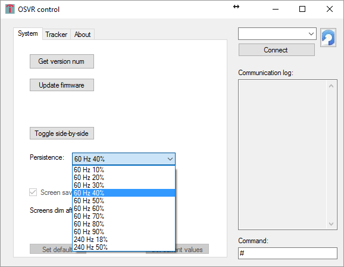

# Video modes
## Input resolutions
The OSVR HDK supports two input resolutions:
- 1080x1920 @ 60 FPS. This is the native video mode and carries the lowest latency with it
- 1920x1080 @ 60 FPS. When the HDK detects this video mode, it automatically performs 90 degree rotation in hardware, to bring this to the native screen resolution of 1080x1920. This 90 degree rotation carries 1 frame (16 mSec) of latency because an entire frame needs to be stored in the HDK memory before being sent to screen. However, this mode is useful in two main use cases:
  - When you want to mirror the desktop
  - When you want to use a wireless video link that does not support 1080x1920 resolution

The HDK reports back using an HID message whether it is detecting video at all, and whether it is receiving 1920x1080 or 1080x1920. See report format in the [HID protocol definition for the OSVR HDK](../Developing/OSVRhdk.md)

## Side by side
The OSVR HDK is usually driven by applications that generate different left and right eye imagery in side-by-side mode. However, it is sometimes useful to replicate the entire image over both eyes. For instance:
  - When viewing the regular desktop from within the HMD
  - When using an application that does not render side-by-side

The user can control which of these modes is being used using the [OSVR HDK Configuration utility](../Utilities/OSVRControl.md). In the utility, use the "Toggle side-by-side" button

## Persistence settings

You can configure the OLED persistence settings through a terminal port or the [OSVR Control utility](../Utilities/OSVRControl.md)

