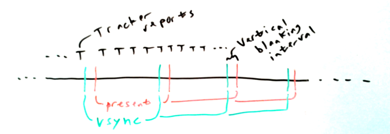
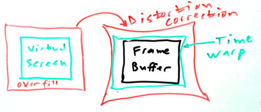

# OSVR Rendering Optimization

This document describes aspects of the OSVR RenderManager's display pipeline relating to optimizing rendering performance and reducing latency.

## 

The timing diagram below shows repeated video frames being sent to the screen by the display hardware.

Each frame starts displaying at the **present** bar, with the first scan lines being displayed.  (Whether all of the pixels are shown at once or they are shown a line or band at a time depends on the display technology being used.)  The pixels are scanned out and displayed, either a row at a time or all together, until the vertical synchronization (**vsync**) bar, at which time the **vertical blanking interval** begins.

To avoid visible artifacts where the screen appears to tear into two parts, the rendering system must avoid updating the data in the frame buffer except during the vertical blanking interval.  One way to do this is to use **double buffering**, which renders into one buffer (called the *back buffer*) and then swaps the buffers during the vertical blanking interval, making it the *front buffer* that is displayed.  The graphics library always renders into the back buffer and then asks the driver to swap buffers at the next vsync.  It is also possible to use only a single buffer, doing **front-buffer rendering**.  This requires the graphics library to interact more closely with the driver and make sure to render into the output buffer only during the vertical blanking interval.

As of 3/8/2016, RenderManager handles [distortion correction](./distortion.md) and time warp (described below) using a second rendering pass.  The client application renders into a virtual screen, which can be oversized to enable distortion correction and time warp to be applied without causing black borders.  When the application is finished rendering, it hands that buffer to RenderManager, who renders it as a texture using a distortion mesh.  For DirectMode rendering pipelines, this can be done using front-buffer rendering.  If so, it must be synchronized with the the vertical blanking interval to avoid tearing.

The **renderManagerConfig** portion of the OSVR server configuration has several entries that control whether and how this synchronization occurs in rendering pipelines that support DirectMode and where **directModeEnabled** is set to *true*.

* **numBuffers**: This selects between front-buffered rendering (1) or double-buffered rendering (2) for the second (distortion/warp) render pass within RenderManager.  Note that double-buffered rendering in this case does not necessarily cause more latency -- if time warp using maxMsBeforeVsync is active, then the back buffer will be swapped to the front immediately after being rendered to.
* **verticalSyncEnabled**: When using double-buffered rendering and this is set to *true*, this has the underlying hardware wait until vsync to present the current buffer, which will avoid tearing because it will not change the buffer being displayed while it is being scanned out.  @todo What happens when we're after vsync already?
* **verticalSyncBlockRenderingEnabled**: When this is set to *true*, RenderManager will block in its rendering/presentation call and not return until the vertical synchronization event has happened (on some render paths and hardware, it waits until the presentation happens).  @todo Waiting until present is wasting time.

## Time Warp

@todo

### Asynchronous

@todo
