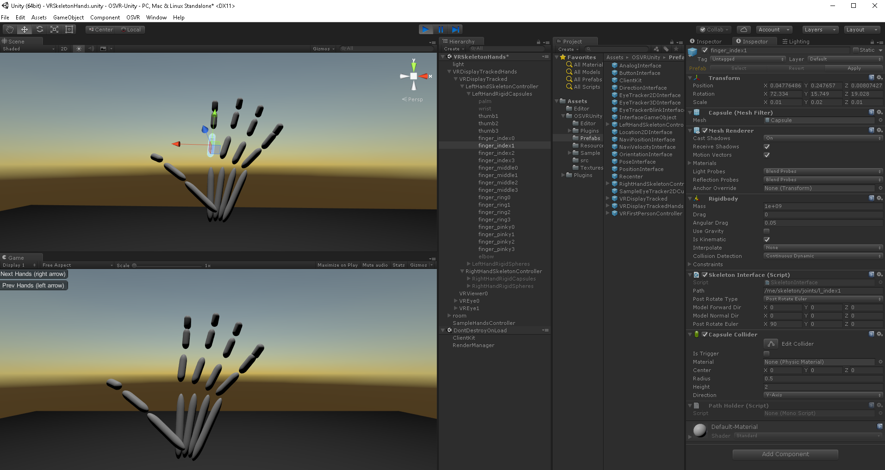

# Skeleton Tracking in OSVR-Unity with Leap Motion

This document outlines how to track [skeleton joints](https://github.com/OSVR/OSVR-Specs-and-Proposals/blob/master/Interface%20Class%20Specifications/Skeleton/InterfaceSpec-Skeleton.md) in OSVR-Unity. We will use the [Leap Motion](https://www.leapmotion.com/) to provide skeleton data in this example, but the same Unity project should work with any plugin that provides skeleton data, such as Kinect or Intel RealSense, by using **semantic paths** to retrieve data in a hardware-agnostic way. The goal is to use LeapMotion as a generic Skeleton provider without including any LeapMotion libraries in the Unity project.

Hardware used in this example:
- [Leap Motion](https://www.leapmotion.com/) sensor for hand-tracking
- OSVR HDK2 with mount for Leap Motion, but any OSVR HMD (HDK, Vive, Fove) could be swapped. HMD is not required to demonstrate skeletal tracking out-of-VR.

Software used in this example:
- [OSVR-Core build or SDK/Runtime installation](http://access.osvr.com/)
- [OSVR-Leap-Motion plugin build](https://github.com/OSVR/OSVR-Leap-Motion)
- [OSVR-Unity plugin](http://access.osvr.com/binary/osvr-unity) and Unity 5.6

### Skeleton Interface
In OSVR, the Skeleton Interface is implemented by devices that provide tracking of joints, limbs, or body parts as a subset of its functionality. The underlying technology may be varied, from vision-based (Leap Motion), to depth-camera based (Kinect/PrimeSense, Kinect 2), to tracker-based (NaturalPoint OptiTrack, ART motion capture and finger tracking), even to datagloves. For more information, see the [Skeleton Interface Class Specification](https://github.com/OSVR/OSVR-Specs-and-Proposals/blob/master/Interface%20Class%20Specifications/Skeleton/InterfaceSpec-Skeleton.md).

### OSVR-Leap-Motion
[OSVR-Leap-Motion](https://github.com/OSVR/OSVR-Leap-Motion) is the OSVR plugin that communicates with the Leap Motion SDK. 
- Install the [Leap Motion SDK](https://developer.leapmotion.com/get-started). We are using version **LeapDeveloperKit_3.2.0+45899_win**.
- Download the latest build of the OSVR-Leap-Motion plugin, or build it from source. Copy to the **bin\osvr-plugins-0\\** directory of your OSVR installation. If you used the [Runtime Installer](http://access.osvr.com/binary/osvr-runtime-installer), the location is: **C:\Program Files\OSVR\Runtime\bin\osvr-plugins-0\**.
- Copy the contents of **\LeapSDK\lib\x64\** or **\LeapSDK\lib\x86\** to the **bin\\** directory of you OSVR installation, so that the Leap Motion libraries are in the same folder as **osvr_server.exe**.

### Semantic Paths
OSVR Developers should understand the concept of **semantic paths** within the OSVR software stack. For a good introduction, review this presentation on the [OSVR-Core Path Tree](https://osvr.github.io/presentations/20150419-osvr-software-framework-path-tree/).
With the server running, you can run `osvr_print_tree.exe` (located next to osvr_server.exe) to print the current path tree.
Every OSVR plugin has a **device descriptor** which factors devices into OSVR interfaces and defines semantic (human-readable) paths to access specific devices. In this example, we’ll examine the skeleton joints exposed in the OSVR-Leap-Motion plugin device descriptor.
### OSVR-Leap-Motion device descriptor ([com_osvr_LeapMotion.json](https://github.com/OSVR/OSVR-Leap-Motion/blob/master/com_osvr_LeapMotion.json)):
```json
{
  "deviceVendor": "Leap Motion",
  "deviceName": "Leap Motion Controller",
  "author": "Zach Kinstner <zach@aestheticinteractive.com>",
  "version": 1,
  "lastModified": "2015-07-23",
  "interfaces": {
    "imaging": {
      "count": 4
    },
    "analog": {
      "count": 12
    },
    "tracker": {
      "count": 46,
      "position": true,
      "orientation": true
    },
    "skeleton": {
      "count": 2,
      "bounded": true
    }
  },
  "articulationSpec": [
    {
      "l_elbow": {
        "$data": {
          "data": "tracker/0",
          "boneName": "l_forearm",
          "type": "joint"
        },
        "l_wrist": {
          "$data": {
            "data": "tracker/1",
            "boneName": "l_hand",
            "type": "joint"
          },
          "l_thumb1": {
            "$data": {
              "data": "tracker/3",
              "boneName": "l_thumb_metacarpal",
              "type": "joint"
            },
            "l_thumb2": {
              "$data": {
                "data": "tracker/4",
                "boneName": "l_thumb_proximal",
                "type": "joint"
              },
              "l_thumb3": {
                "$data": {
                  "data": "tracker/6",
                  "boneName": "l_thumb_distal",
                  "type": "joint"
                }
              }
            }
          },
          "l_index0": {
            "$data": {
              "data": "tracker/7",
              "boneName": "l_index_metacarpal",
              "type": "joint"
            },
            "l_index1": {
              "$data": {
                "data": "tracker/8",
                "boneName": "l_index_proximal",
                "type": "joint"
              },
              "l_index2": {
                "$data": {
                  "data": "tracker/9",
                  "boneName": "l_index_middle",
                  "type": "joint"
                },
                "l_index3": {
                  "$data": {
                    "data": "tracker/10",
                    "boneName": "l_index_distal",
                    "type": "joint"
                  }
                }
              }
            }
          },
          "l_middle0": {
            "$data": {
              "data": "tracker/11",
              "boneName": "l_middle_metacarpal",
              "type": "joint"
            },
            "l_middle1": {
              "$data": {
                "data": "tracker/12",
                "boneName": "l_middle_proximal",
                "type": "joint"
              },
              "l_middle2": {
                "$data": {
                  "data": "tracker/13",
                  "boneName": "l_middle_middle",
                  "type": "joint"
                },
                "l_middle3": {
                  "$data": {
                    "data": "tracker/14",
                    "boneName": "l_middle_distal",
                    "type": "joint"
                  }
                }
              }
            }
          },
          "l_ring0": {
            "$data": {
              "data": "tracker/15",
              "boneName": "l_ring_metacarpal",
              "type": "joint"
            },
            "l_ring1": {
              "$data": {
                "data": "tracker/16",
                "boneName": "l_ring_proximal",
                "type": "joint"
              },
              "l_ring2": {
                "$data": {
                  "data": "tracker/17",
                  "boneName": "l_ring_middle",
                  "type": "joint"
                },
                "l_ring3": {
                  "$data": {
                    "data": "tracker/18",
                    "boneName": "l_ring_distal",
                    "type": "joint"
                  }
                }
              }
            }
          },
          "l_pinky0": {
            "$data": {
              "data": "tracker/19",
              "boneName": "l_pinky_metacarpal",
              "type": "joint"
            },
            "l_pinky1": {
              "$data": {
                "data": "tracker/20",
                "boneName": "l_pinky_proximal",
                "type": "joint"
              },
              "l_pinky2": {
                "$data": {
                  "data": "tracker/21",
                  "boneName": "l_pinky_middle",
                  "type": "joint"
                },
                "l_pinky3": {
                  "$data": {
                    "data": "tracker/22",
                    "boneName": "l_pinky_distal",
                    "type": "joint"
                  }
                }
              }
            }
          }
        }
      }
    },
    {
      "r_elbow": {
        "$data": {
          "data": "tracker/23",
          "boneName": "r_forearm",
          "type": "joint"
        },
        "r_wrist": {
          "$data": {
            "data": "tracker/24",
            "boneName": "r_hand",
            "type": "joint"
          },
          "r_thumb1": {
            "$data": {
              "data": "tracker/26",
              "boneName": "r_thumb_metacarpal",
              "type": "joint"
            },
            "r_thumb2": {
              "$data": {
                "data": "tracker/27",
                "boneName": "r_thumb_proximal",
                "type": "joint"
              },
              "r_thumb3": {
                "$data": {
                  "data": "tracker/29",
                  "boneName": "r_thumb_distal",
                  "type": "joint"
                }
              }
            }
          },
          "r_index0": {
            "$data": {
              "data": "tracker/30",
              "boneName": "r_index_metacarpal",
              "type": "joint"
            },
            "r_index1": {
              "$data": {
                "data": "tracker/31",
                "boneName": "r_index_proximal",
                "type": "joint"
              },
              "r_index2": {
                "$data": {
                  "data": "tracker/32",
                  "boneName": "r_index_middle",
                  "type": "joint"
                },
                "r_index3": {
                  "$data": {
                    "data": "tracker/33",
                    "boneName": "r_index_distal",
                    "type": "joint"
                  }
                }
              }
            }
          },
          "r_middle0": {
            "$data": {
              "data": "tracker/34",
              "boneName": "r_middle_metacarpal",
              "type": "joint"
            },
            "r_middle1": {
              "$data": {
                "data": "tracker/35",
                "boneName": "r_middle_proximal",
                "type": "joint"
              },
              "r_middle2": {
                "$data": {
                  "data": "tracker/36",
                  "boneName": "r_middle_middle",
                  "type": "joint"
                },
                "r_middle3": {
                  "$data": {
                    "data": "tracker/37",
                    "boneName": "r_middle_distal",
                    "type": "joint"
                  }
                }
              }
            }
          },
          "r_ring0": {
            "$data": {
              "data": "tracker/38",
              "boneName": "r_ring_metacarpal",
              "type": "joint"
            },
            "r_ring1": {
              "$data": {
                "data": "tracker/39",
                "boneName": "r_ring_proximal",
                "type": "joint"
              },
              "r_ring2": {
                "$data": {
                  "data": "tracker/40",
                  "boneName": "r_ring_middle",
                  "type": "joint"
                },
                "r_ring3": {
                  "$data": {
                    "data": "tracker/41",
                    "boneName": "r_ring_distal",
                    "type": "joint"
                  }
                }
              }
            }
          },
          "r_pinky0": {
            "$data": {
              "data": "tracker/42",
              "boneName": "r_pinky_metacarpal",
              "type": "joint"
            },
            "r_pinky1": {
              "$data": {
                "data": "tracker/43",
                "boneName": "r_pinky_proximal",
                "type": "joint"
              },
              "r_pinky2": {
                "$data": {
                  "data": "tracker/44",
                  "boneName": "r_pinky_middle",
                  "type": "joint"
                },
                "r_pinky3": {
                  "$data": {
                    "data": "tracker/45",
                    "boneName": "r_pinky_distal",
                    "type": "joint"
                  }
                }
              }
            }
          }
        }
      }
    }
  ],

  "semantic": {
    "camera": {
      "$target": "imaging/0",
      "left": {
        "$target": "imaging/0",
        "distortion": "imaging/2"
      },
      "right": {
        "$target": "imaging/1",
        "distortion": "imaging/3"
      }
    },
    "connection": {
      "device": "analog/0",
      "service": "analog/1"
    },
    "skeleton": {
      "dataAvailable": {
        "leftHand": "skeleton/0",
        "rightHand": "skeleton/1"
      },
      "joints": {
        "l_elbow": "tracker/0",
        "l_wrist": "tracker/1",
        "x_l_palm": "tracker/2",
        "l_thumb1": "tracker/4",
        "l_thumb2": "tracker/5",
        "l_thumb3": "tracker/6",
        "l_index0": "tracker/7",
        "l_index1": "tracker/8",
        "l_index2": "tracker/9",
        "l_index3": "tracker/10",
        "l_middle0": "tracker/11",
        "l_middle1": "tracker/12",
        "l_middle2": "tracker/13",
        "l_middle3": "tracker/14",
        "l_ring0": "tracker/15",
        "l_ring1": "tracker/16",
        "l_ring2": "tracker/17",
        "l_ring3": "tracker/18",
        "l_pinky0": "tracker/19",
        "l_pinky1": "tracker/20",
        "l_pinky2": "tracker/21",
        "l_pinky3": "tracker/22",

        "r_elbow": "tracker/23",
        "r_wrist": "tracker/24",
        "x_r_palm": "tracker/25",
        "r_thumb1": "tracker/27",
        "r_thumb2": "tracker/28",
        "r_thumb3": "tracker/29",
        "r_index0": "tracker/30",
        "r_index1": "tracker/31",
        "r_index2": "tracker/32",
        "r_index3": "tracker/33",
        "r_middle0": "tracker/34",
        "r_middle1": "tracker/35",
        "r_middle2": "tracker/36",
        "r_middle3": "tracker/37",
        "r_ring0": "tracker/38",
        "r_ring1": "tracker/39",
        "r_ring2": "tracker/40",
        "r_ring3": "tracker/41",
        "r_pinky0": "tracker/42",
        "r_pinky1": "tracker/43",
        "r_pinky2": "tracker/44",
        "r_pinky3": "tracker/45"
      }
    },
    "arms": {
      "left": {
        "available": "analog/2",
        "hand": {
          "confidence": "analog/4",
          "grabStrength": "analog/6",
          "pinchStrength": "analog/8",
          "palmWidth": "analog/10"
        }
      },
      "right": {
        "available": "analog/3",
        "hand": {
          "confidence": "analog/5",
          "grabStrength": "analog/7",
          "pinchStrength": "analog/9",
          "palmWidth": "analog/11"
        }
      }
    }
  },
  "automaticAliases": {
    "/camera": "semantic/camera/*",
    "/connection": "semantic/connection/*",
    "/me/arms": "semantic/arms/*",
    "/me/hands/left": "semantic/skeleton/joints/x_l_palm",
    "/me/hands/right": "semantic/skeleton/joints/x_r_palm",
    "/me/hands/left/skeleton": "semantic/skeleton/dataAvailable/leftHand",
    "/me/hands/right/skeleton": "semantic/skeleton/dataAvailable/rightHand",
    "/me/skeleton/joints": "semantic/skeleton/joints/*",
    "/controller/left/trigger": "semantic/arms/left/hand/pinchStrength",
    "/controller/right/trigger": "semantic/arms/right/hand/pinchStrength"
  }
}
```

Review the device descriptor to understand how the Leap Motion device is factored into OSVR interfaces. Notice the left and right hands are aliased to the left and right palms, respectively:
```json
 "/me/hands/left": "semantic/skeleton/joints/x_l_palm",
 "/me/hands/right": "semantic/skeleton/joints/x_r_palm"
```
This means that any existing OSVR application using this path will be able to receive hand positions from the Leap Motion sensor without any updates to the application. We'll also be able to view the hands being tracked in [OSVRTrackerView](http://access.osvr.com/binary/osvr-tracker-view) by default.

Also of note is the automatic alias:
```json
"/me/skeleton/joints": "semantic/skeleton/joints/*"
```
We'll use this is Unity to track each joint in the hands, such as accessing the base of the left index finger via the path:
```json
/me/skeleton/joints/l_index0
```
### OSVR Server Configuration
Using the Leap Motion doesn't require any special OSVR server configuration. The plugin is loaded automatically if it is present in **bin/osvr-plugins-0/** directory. We'll use a configuration for HDK2 with orientation-only tracking, such as [/sample-configs/osvr_server_config.renderManager.HDKv2.0.direct.json](https://github.com/OSVR/OSVR-Core/blob/master/apps/sample-configs/osvr_server_config.renderManager.HDKv2.0.direct.json). 

### OSVR-Unity
It is recommended to review the [OSVR-Unity Getting Started Guide](https://github.com/OSVR/OSVR-Unity/blob/master/GettingStarted.md) if you are new to OSVR-Unity. This document assumes the user is already familiar OSVR-Unity.

**SkeletonInterface.cs**
The SkeletonInterface class is responsible for obtaining pose reports (position and rotation) at a given path. If the skeleton joints are being mapped to a rigged 3d model, such as the hand models distributed with the Leap Motion assets, additional post-rotation may be necessary in order to fit the model constraints. If the joints are not mapped to a rigged model, post-rotation is not necessary, and the SkeletonInterface is essentially just a PoseInterface.


In our Unity project, each skeleton joint has a gameobect with SkeletonInterface component attached which specifies a path to that joint.

- Create a new Unity project and import the [OSVR-Unity unitypackage](http://access.osvr.com/binary/osvr-unity).
- Open the VRSkeletonHands.unity scene.



- After you've completed the OSVR-Leap-Motion setup above, run **osvr_server.exe**.
- Play the Unity scene.

Your hands should now be tracked, and visibly represented in the scene by prefabs made up of primitive objects. The **VRDisplayTrackedHands** prefab includes left and right hands. In the Hierarchy view, expand a hand such as **LeftHandRigidCapsules** to see that the object is composed of skeleton joints, each one with a different path.

**Rigging 3D Hand Models**
Although not included with the initial release, it is possible to animate a 3d model with the incoming skeleton data. For more information about creating a rigged 3d hand, please see [Leap Motion documentation](https://developer.leapmotion.com/documentation/unity/unity/Unity_Hand_Rigging.html) on hand rigging. Given an existing 3d hand model, such as those distributed with the Leap Motion Unity assets, one can modify the gameobject to work with this example by:
- Flattening the object hierarchy so that all fingers are siblings, not parent-child relationships. The incoming skeleton data is in world-space, not hand-space.
- Adding a SkeletonInterface component to each gameojbect which represents a hand joint, providing a path for each data source.
- In the Inspector view of the SkeletonInterface component, a post rotation may need to be applied according to the model's forward and normal direction. For Leap Motion Hand Models, a forward direction of (1,0,0) and (0,-1,0) translates to a correct-looking mapping in OSVR-Unity.