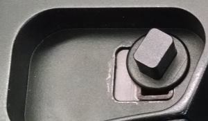
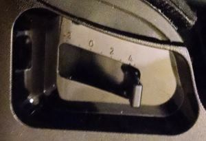
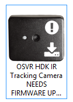
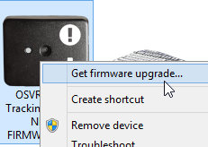
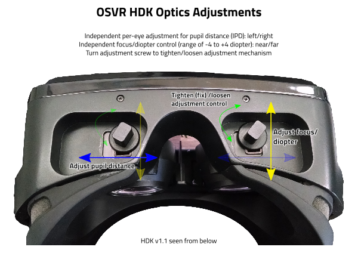

# Congrats on your Hacker Development Kit!

Please note the "last-modified" date on this page - OSVR is a fast moving set of projects, so limitations mentioned here may no longer apply when you read this.

## Identifying your Device
The main varieties of HDK in the wild are the HDK 1.2 and the HDK 1.3. Both varieties came in a cardboard box with carry handle and OSVR branding and generally shipped with an IR tracking camera kit.

> Note: If you got yours before mid-2015, particularly if it didn't come in a fancy assembly-line box with an IR camera, it appears to have an LCD screen instead of an OLED screen, then it might be an earlier prototype. You can generally treat it just like a 1.2, except that you'll want to avoid upgrading the firmware without contacting support: we wouldn't want you to install OLED firmware on an LCD unit, and because the Hacker Development Kit is designed to be hackable even down to the display, that's possible.

The main exterior difference between the 1.3 and preceding versions is the adjustments for the optics, so it's the easiest way to identify what you have if you are unsure:

- The HDK 1.2 and earlier have thumbscrew-adjusters underneath each eye, with pupil-distance and focus adjustment. This image is from a 1.1, but the mechanism on the 1.2 is effectively the same. 
- The HDK 1.3 have simple sliders underneath each eye for focus adjustment (modified optics for a larger eyebox removed the need for adjustable pupil distance.). 

Additionally, there are some differences generally noted between the chipsets shipped in the belt boxes with 1.2 units and 1.3 units, so once you have the driver pack installed (if you're using Windows), that can also help remind you, but the mechanical differences are the most reliable.

## Caveats/Limitations
- The current default configuration file on Windows assumes an HDK 1.3, direct mode rendering, and fused IMU and video-based (aka positional) tracking. If you are using a 1.2 (thumbscrew-adjusters on the lenses, not sliders), or can't/don't want to use direct mode, you'll want to switch config files. There are config files with self-documenting names included - for something more substantial than "filenames", see [Configuring the OSVR HDK](../Configuring/osvrhdk.md).
- The OSVR Server currently shows a console window that can be minimized, but should not be closed while you're using OSVR applications. A more appealing or invisible interface is coming.

## Setup

### Calibration
Each time you switch places when using the HDK , you can do a little calibration for the internal sensors to prevent some drift.
Simply plug the HDK to the computer, see if it's ON, and with the HDK in your hands move it in an 8 figure up and down facing forward. Repeat the 8 figure four times at least. There is no need to run any software for this calibration.

### Connect the HDK and IR Camera
There are a few connections to make: the headset to the beltbox, power from the wall to the beltbox, and HDMI and USB between the beltbox and your computer. Order does not particularly matter. You'll want to make sure that you have the beltbox held or clipped in such a way that cables don't tug during use.

If you're using the video-based tracker, make sure you get the sync cables set up at this point as well, too.

Once you have the headset, HDMI, power plugged in, the HMD should be recognized as a new display on your computer.  Windows users, you'll want to choose to "extend your display" in "Display Properties". (Linux users: you can extend your display to it or you can run a separate X screen on it, your choice depending on how you want to use it.)

It will likely show up as a 1080x1920 "Portrait" display by default. This is the highest-performance mode. However, at this time most applications don't work with it in that mode, so you'll want to select the 1920x1080 resolution instead. (This doesn't mean you have to change the "Rotation" setting - just choose the alternate resolution and the HMD will perform the rotation internally.)

You'll also want to connect the IR camera at this point, if nothing else so that you can update the firmware. Unfortunately, at this time the IR camera firmware updater only runs on Windows.

### Windows: Install the driver pack (optional, but recommended)
If you're on Windows, there's a driver pack installer that can improve your experience. While not strictly necessary for basic use, it does provide better names for devices in the Device Manager, groups device components logically with corresponding icons in the "Devices and Printers" window, and on Windows 8.1 and earlier, is required to use the OSVR HDK control software to upgrade firmware, etc. (Windows 10 already includes the appropriate driver there, but the other benefits still apply.)

You can get the latest release here: <https://github.com/OSVR/OSVR-HDK-Windows-Drivers/releases>. Download and install it before moving on.

### GPU Drivers
Check [RenderManager Troubleshooting](../../Troubleshooting/RenderManager.md) for latest tested drivers.

### Check/update firmware
There are several parts of the system that have firmware that can be updated.

**The IR Camera firmware** is very important to update, as newer firmware can provide substantially improved performance as well as compatibility with Linux, OS X, and other software packages besides the OSVR Server video tracking plugin. On Windows, with drivers 1.2.6 or newer, from Start, type "Devices and Printers" and press Enter, and you should see a number of OSVR-related icons matching what you have plugged in.

If your icon for the IR Camera looks like this:



right-click it, and choose the "Get firmware upgrade" option. (Alternately you can go to <http://osvr.github.io/using/>)



Once there, you'll want to find the download for the IR camera firmware upgrader: it will be marked with this symbol: 

> Non-Windows users: While you unfortunately can't do the upgrade on your system, you can check and see the firmware version, as it's part of the USB hardware ID. The vendor ID is 0x0bda, product ID is 0x57e8, and the firmware version is whatever is listed in the `bcdDevice` field (which shows up as `REV_` on Windows).
> On Linux, `lsusb -v -d 0bda:57e8` gets lots of information on the device, and `lsusb -v -d 0bda:57e8 | grep bcdDevice` shows just the revision: 0.07 for version 7, the latest at this writing. If it's smaller, then the firmware needs an update.

**The HDK main processor** also has firmware.

If you have an HDK 1.2, the most recent firmware you'll want to install is version **1.84** - newer versions contain code specific to the different OLED screen in the 1.3. See the instructions for a special [HDK 1.2 upgrade procedure](HDK-1.2-Firmware-Update.md) that will automatically install this firmware, as well as automating the process of updating the processor's VID/PID in case you have an early unit where these were faulty.

On both the 1.2 and 1.3, the OSVR HDK Control utility on Windows is the best way to upgrade firmware and adjust some special features of the HMD. Go to <http://osvr.github.io/using/> to get it. It can also report the current version of firmware that you have installed, etc.

The HDK firmware can be upgraded on Linux or Mac OS X, but the process hasn't been fully documented yet. If you need instructions, contact support, and we'll walk you through it and update the docs at the same time.

### Get OSVR Server
OSVR Server is part of the OSVR software framework, and provides the system for accessing device data, configuring peripherals, etc. The HDK drivers come bundled in the main OSVR Core package (which includes the server), and your HDK can be auto-detected, so you won't need to edit any config files unless you want to connect additional input devices.

There are two ways of getting the OSVR Server: the installer and build snapshots. Both can be obtained from the [Using OSVR][using] page. The installer is a more convenient option that bundles latest OSVR-Core snapshot, OSVR tools and documentation, while build snapshots allow to get various components individually. Most users will prefer the [OSVR Runtime][osvr-runtime] for Windows installer. Developers should select the [OSVR SDK][osvr-sdk] for Windows installer which contains additional content and tools necessary for OSVR development. If you're using a 64-bit version of Windows, either 32 or 64 bit will work (and be compatible with both 32 and 64-bit applications), so just pick one.  (Linux users: please see the  [build instructions](../Installing/Linux-Build-Instructions.md) in this repository.)

In any case, running the `osvr_server` application should open a command-line window displaying some messages. If everything is working right, you'll see a line that says something like:

```
Added device: com_osvr_Multiserver/OSVRHackerDevKit0
```
If you are on Linux or Mac and do not get this output line, refer to the [known issues].

You can minimize this window, but make sure to keep it running as long as you'll be using OSVR applications.

[OSVR-Core]: https://github.com/OSVR/OSVR-Core/
[using]: http://osvr.github.io/using/
[known issues]: ../Installing/Linux-Build-Instructions.md#known-issues-temporary
[osvr-runtime]: http://access.osvr.com/binary/osvr-runtime-installer
[osvr-sdk]: http://access.osvr.com/binary/osvr-sdk-installer

### Configuring the OSVR Server for your HDK
The default configuration should work for HDK 1.3/1.4 users with systems capable of direct mode, but there are other configuration options. Additionally, there's a configuration tool for the HMD itself that can allow you to customize things further.  See [Configuring the OSVR HDK](../Configuring/osvrhdk.md) for details.

### Adjust the Optics (HDK 1.0, 1.1, 1.2)


This diagram of HDK optics adjustments ([printable full-page PDF here](HDK-optics-adjustment.pdf]) shows what the adjustments are. You'll want to adjust them while wearing the display and with an image displayed on the screen (plugged in, etc.), but one eye at a time (close the other eye). You can use your glasses (or lack thereof) to estimate approximately where you'll want to start the focus control at, then adjusting the IPD until the lens feels and looks "centered" with your eye and all parts of the screen are equally sharp.

### Adjust the Optics (HDK 1.3)

The sliders on the bottom of the 1.3 adjust focus in diopters. If you normally wear glasses, you may be able to take them off and adjust the focus sliders instead to see a sharp image. Otherwise, just adjust them until you see a sharp image in both eyes, likely when both eyes are around the tick-mark labeled 0.


## Software

### Tracker Viewer
The first application we suggest you try isn't glamorous, but it's handy for checking to make sure that things are working. On the [Using OSVR][using] page, you'll see a download link for the OSVR Tracker Viewer. Download and run that (with the OSVR Server running!), and you'll get a small window with some 3D arrows in it. If you're 3D-graphics savvy or VR-savvy, you'll probably figure out what they are and what they mean, but the important part in general is to just verify that the small arrows in the middle move when you rotate the headset. (You can right-click and drag to zoom in to see it better)

Of course, you can skip this step, but if you have problems, someone will probably ask you what you see when you run Tracker Viewer.

### The "Palace" Demo
The [OSVR Unity Palace Demo](https://github.com/OSVR/OSVR-Unity-Palace-Demo/releases) [(source repo)](https://github.com/OSVR/OSVR-Unity-Palace-Demo) is a visually-rich environment to look around and explore in using OSVR-supported hardware, including the HDK. The first link contains binary downloads for Windows: just download and run (make sure the OSVR server is running!), and if desired move around in the environment with a gamepad or keyboard and mouse. On the start-up screen you'll want to choose the display that your HDK is configured as, and the 1920x1080 full HD resolution.

Note that in this application, as with all Unity applications, if you "click away" from the app (so it is no longer the focused/active application) it will stop updating the OSVR plugin, and thus the display will appear to freeze (since no tracking data is being received). Most of the time you can just click the taskbar icon for the application to restore focus and pick up where you left off.

## Help!

[Custom Google Search for the OSVR project](https://cse.google.com/cse/publicurl?cx=016285390483464504735:ifzwvrb3lp4)

If you're having hardware or software problems in general, just open a help ticket with [OSVR Support](http://support.osvr.com).

If you'd like to develop OSVR software or contribute in some way, please see the [Developer Portal at osvr.github.io](http://osvr.github.io) to join the development discussion/mailing list, and see the list of projects and their contribution information.

Support tickets are monitored by multiple people so they'll be handed smoothly by the best person available and suited to your question. GitHub and the developer mailing list are the main ways to reach current developers contributing to OSVR.

- It's not recommended to ask about problems or post questions elsewhere (forums/reddit, twitter, etc.) if you want a developer or "official" response, since those aren't venues we (developers/technical people) necessarily frequent daily or control the "official" accounts on.
- As a general rule of open-source communities, and thus in OSVR as well, it's usually considered rude to email a developer personally with a question. Among other reasons, it only allows a single person to handle your question (when there may be others who could do so and perhaps better) and doesn't archive a potentially useful exchange in searchable archives. (Don't be surprised if your email gets forwarded to the support ticket system if you do this.)
