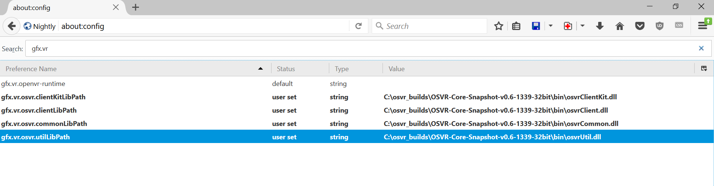

#How to use OSVR in Firefox:

1. Download the latest Firefox Nightly build available here - <https://nightly.mozilla.org/>
2. Go to the address bar and type "about:config", which will bring up a list of Firefox settings
3. Search for `dom.vr.osvr.enabled` and set that field to true which will enable OSVR support.
4. Fill in the paths for OSVR libraries (DLLs available both in Runtime and SDK installer) for the following settings:
	`gfx.vr.osvr.clientKitLibPath`
	`gfx.vr.osvr.clientLibPath`
	`gfx.vr.osvr.commonLibPath`
	`gfx.vr.osvr.utilLibPath`

	These paths are located either in the Runtime/SDK or in the snapshot build. For example, if OSVR Runtime is installed in "C:\Program Files\OSVR\Runtime\", then you would find OSVR DLLs in "bin" subdirectory.

	Make sure that you are using the correct bitness of OSVR DLLs, 32 bit OSVR DLLs if you're using 32-bit Firefox Nightly and 64 bit DLLs if you're using 64-bit Firefox Nightly.

	Open Firefox Nightly, and in the address bar type "about:config" which will bring up a list of all settings. In the search bar type "gfx.vr.osvr" and it will bring up those settings. Enter the full path for each of the corresponding DLL in the "Value" column.

	A screenshot below provides reference on how it is configured on a sample system.

	
	
5. Start OSVR server with a device of your choice plugged in.
6. Restart Firefox.
7. Check out <https://mozvr.com/> for some of the WebVR demos.

Note: The current implementation supports extended mode.
