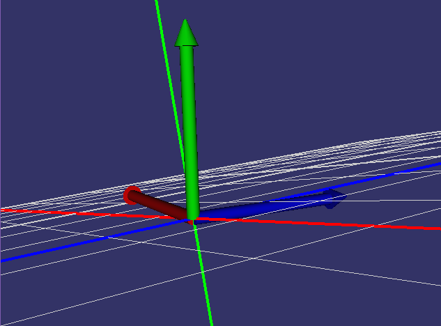
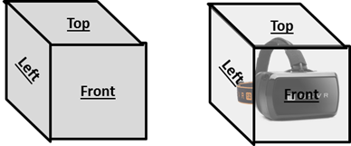
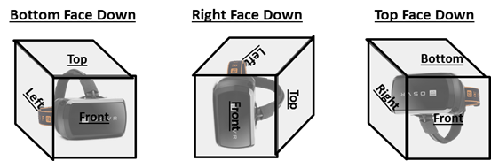
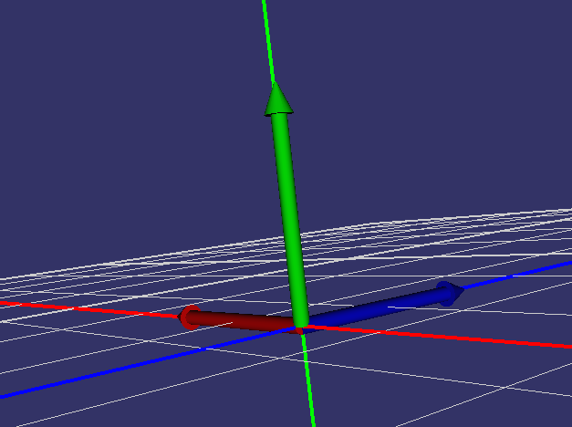
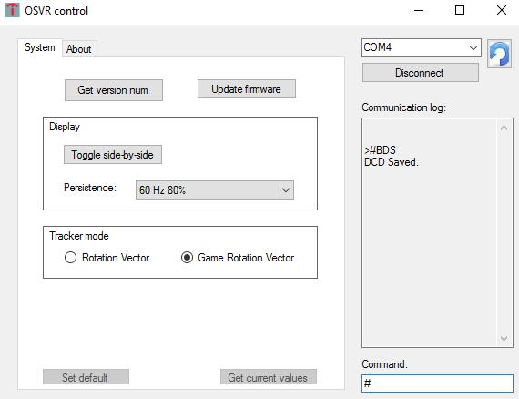

# Device-specific information

## HDK
### Skewed Tracker Orientation
If the HDK tracker is skewed in a normal resting position, even after running osvr_reset_yaw.exe, it’s possible that the accelerometer is not calibrated well.

One parameter of accelerometers is called the Zero G Offset (ZGO).  This can vary from unit to unit and can change over time.  If you have a poorly calibrated accel ZGO, then it could look to the algorithm like it is slightly tilted.  The BNO070 has dynamic accelerometer calibration, but you have to induce certain motions for it to fully take effect. 

The accelerometer will be calibrated after the device is moved into 4-6 unique orientations and held in each orientation for ~3-4 seconds.  One way to think about this is the “cube” method.  Imagine that the headset is a standard cube with 6 faces (Front, Back, Left, Right, Top, Bottom).

Orient the headset so that it is sitting on each face of the cube sequentially.  For example, start with the device positioned normally (bottom face of the cube down).  Then orient it so that the right side of the cube is facing down.  Then continue through the rest of the faces of the cube.  Here’s a quick example:

Hold the headset in each orientation for about 3-4 seconds.  Then when finished, try running OSVRTrackerView.exe.

 
If the issue has gone away you can run the following COM port command via OSVR Control to force the calibration to save to flash (this will happen automatically after 5 minutes but it’s not a bad idea to force it to do so).
 
"#BDS"
 
It should say “DCD Saved” if successful.

## Razer Hydra

- The Razer Hydra driver package from Razer is NOT required, and in fact can sometimes conflict.
- If you have difficulties and have installed the Razer driver for the Hydra, try closing the tray application or uninstalling it—it has been known to switch the Hydra from motion controller mode back into game controller mode while in use or otherwise interfere with the OSVR server's Hydra support.
- The OSVR server should automatically detect if the Hydra is connected when it starts, and print some messages if it is.
- To calibrate the Hydra, you need to put both controllers on the base, on the appropriate sides (look at the triggers to see which is left and which is right). This will ensure hemisphere tracking is correct and will re-set the rotation, as shown below (only one controller shown for clarity). Note that this is the non-Unity coordinate system - Unity should be equivalent but with the Z (blue) pointing the opposite direction.

## YEI 3-Space Sensor

- [Driver here](http://opengoggles.org/preview/3-Space_Driver_Install.zip)
- YEI does not have a signed driver, so follow these instructions for install on Windows 8 or 8.1: http://forum.yeitechnology.com/viewtopic.php?f=3&t=24
- Note the COM port assigned to the USB-Serial device created by the driver, you will need to configure this in osvr_server_config.json.
- High COM ports (above around 8 or 10) may require specifying the port as \\.\COM13 for the time being. (GitHub issue reference: https://github.com/sensics/OSVR-Core/issues/7)
- Useful link about hidden com ports, if your numbers are getting very high: [How to Find Hidden COM Ports](https://learn.adafruit.com/how-to-find-hidden-com-ports/overview)
