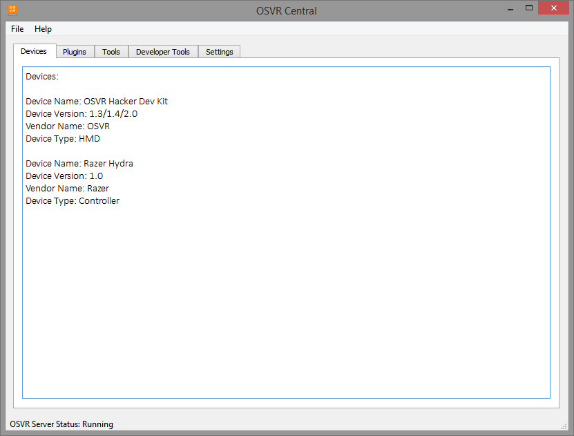
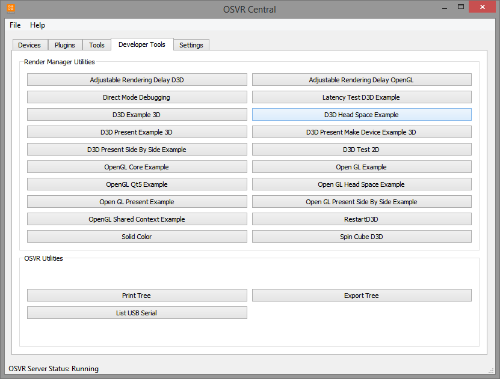
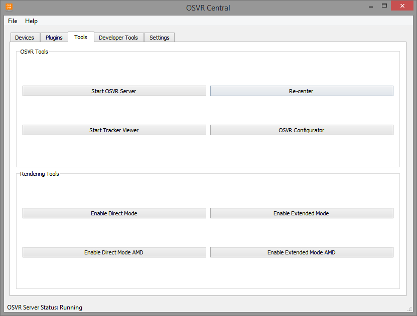
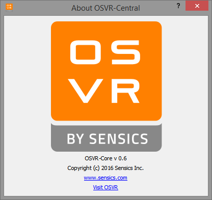

#OSVR-Central

OSVR-Central is an application that serves as a main hub for controlling OSVR.

It includes the following features :

- Device Detection (hotplugging) : OSVR continues to add support for new devices and hotplugging feature detects when a user plugs in or removes an OSVR compatible device.
- Ability to detect and launch OSVR server : OSVR-Central detects if there is an OSVR server running already and allows to launch it on demand
- OSVR Tools : useful tools that allow to Enable/Disable direct mode, re-center the game/demo and many others
- Developer Tools : provide access to Render Manager utilities and demos as well as OSVR tools useful to developers.

Auto updating feature and on-demand plugin downloads are coming soon. OSVR-Central comes bundled with the latest
runtime and SDK installers, which can be downloaded from [OSVR website](http://osvr.github.io/using).

##Screenshots

