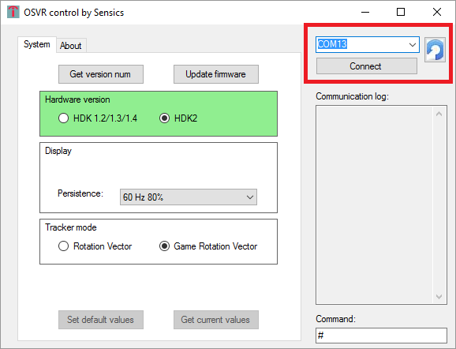
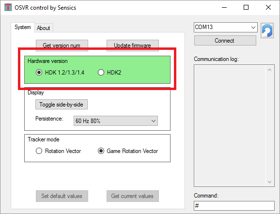
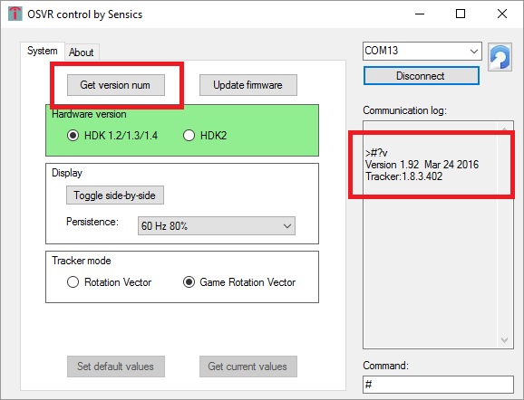
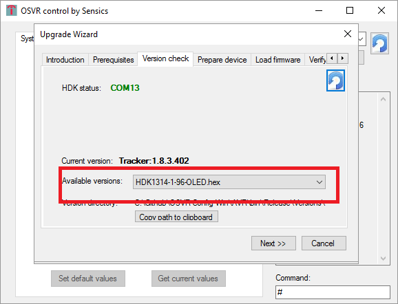
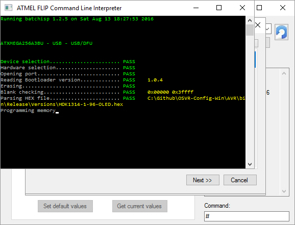

# OSVR Control

OSVR Control is a simple interactive utility for Windows that allows controlling various aspects of the OSVR HDK, including upgrading the main firmware.

**Note:** To upgrade the firmware on Linux or other operating systems, [see these instructions](UpdateHDKLinux.md)

## Installation
OSVR Control is available at [this link](http://sensics.com/software/OSVRControl-SW/publish.htm) on the Sensics Website. It is a one-click Windows installer.

## Connecting to an OSVR HDK
An OSVR HDK provides a virtual COM port interface to Windows. When launching OSVR control, the available COM ports that have been detected (according to VID/PID combination) as OSVR HDK will be displayed at the top right corner. Click 'connect' to select the desired HDK.

## Firmware upgrade
The OSVR Control program includes a wizard for firmware upgrade. The firmware is different for HDK versions 1.x and HDK version 2. **Make sure the hardware version is correctly set in the main window**

If you want to determine the current firmware version of the HDK, click the 'get version num' button and see the result on the right side

Once the HDK is connected, select 'firmware upgrade' and follow the step-by-step instructions. The wizard will walk you through the various stages of obtaining the right software to perform the upgrade as well as allow you to select the appropriate firmware version

## Persistence setting
Use the OSVR control utility to select one of many persistence settings. Requires firmware version 1.91 and above. 

## Selecting side-by-side mode
To switch between regular mode (accepts SBS content) and a mode that replicates the video input on both eyes - useful for looking at your desktop - click the 'toggle side-by-side' button.

**Note:** this option is only available on HDK 1.x models.
 
## Command line utility
The terminal window at the right side of the application allows you to enter and view manual commands for the OSVR HDK. For instance, the command `#?v` returns the version number and compilation data of the OSVR firmware.

## Auto updates
The OSVR Control utility automatically checks for updates when launched. Updates include new firmware and control features
